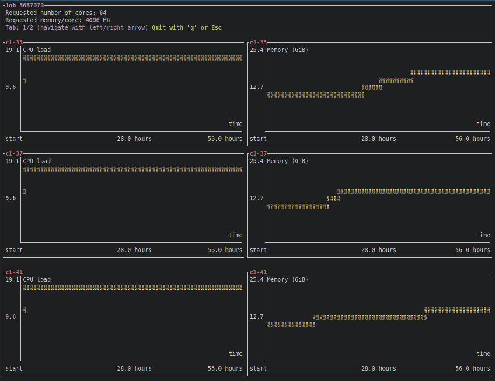

# jobgraph

Visualize CPU and memory usage for Slurm jobs over time, directly in your
terminal.

Requires data generated by [Sonar](https://github.com/NordicHPC/sonar).




## Status of the project

- We are still testing it and haven't announced it to users yet
- Ironing out some [issues](https://github.com/NordicHPC/jobgraph/issues)


## How to use it

```
$ jobgraph --help
$ jobgraph --job-id 7990156
```

Then exit by typing "q".


## Instructions for local development

First fetch the data from Saga:
```
$ rsync --info=progress2 -a saga.sigma2.no:/cluster/shared/sonar/data .
```

Now try to run it with this specific job ID (but you need to adjust
`slurm.rs` to return you the synthetic testing data):
```
$ cargo build
$ ./target/debug/jobgraph --help
$ ./target/debug/jobgraph --data-path data --job-id 8685376 --debug
```
